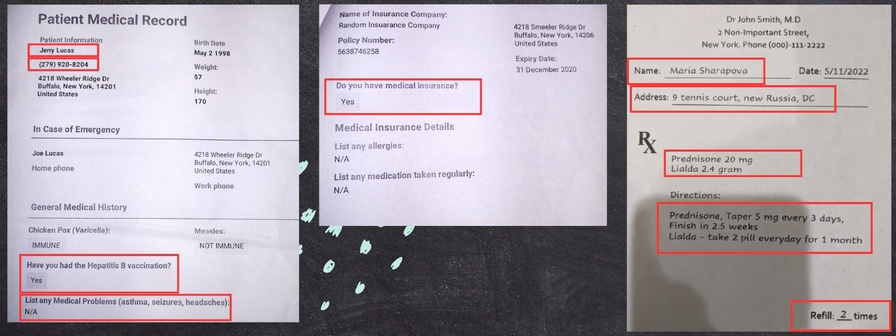
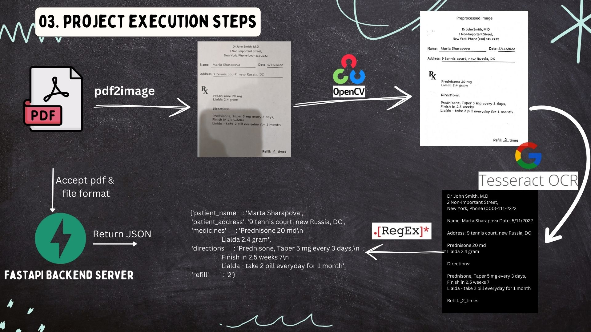

# Medical Data Extraction
An OCR project to extract information about Patient and Prescription details from PDF Documents.
Also this project involved creation of a backend server which will process data extraction requests.

## Demo

https://github.com/TheYashMalore/Medical-Data-Extraction/assets/119494643/4e7f5887-775a-4887-93b3-83db282b72de

## Overview
1. [What is OCR?](#a1)
2. [Introduction to Project](#a2)
3. [Why this project?](#a3)
4. [Project Execution Steps](#a4)
5. [Code Walkthrough](#a5)
6. [What did I learn through this project?](#a6)
7. [Directory Structure of Project](#a7)
8. [Installation Instructions](#a8)

## <a name="a1">1. What is OCR?</a>
OCR (Optical Character Recognition) converts scanned documents, PDFs, and images into editable text using machine learning and AI to improve accuracy.

Common uses of OCR:

1. **Document Digitization**: Converts paper documents to digital format for easy storage and retrieval.
2. **Data Entry Automation**: Automates extraction of text from invoices, receipts, and forms.
3. **Banking and Finance**: Reads checks and processes financial forms quickly and accurately.
4. **Healthcare**: Digitizes medical records and prescriptions for quick access.
5. **Retail and E-commerce**: Manages inventory and extracts product info from images.
6. **Automated License Plate Recognition (ALPR)**: Reads vehicle license plates for traffic and security.
7. **Translation Services**: Converts printed text for automatic language translation.
8. **Accessibility**: Converts text to audio or Braille for the visually impaired.
9. **Legal and Compliance**: Searches and analyzes legal documents quickly.
10. **Education**: Grades exams and digitizes handwritten notes.

## <a name="a2">2. Introduction to Project</a>
When visiting a hospital, we fill out forms that help create our medical history, including prescriptions and test reports. This history can be used for purposes like health insurance claims.

Health insurance companies receive thousands of these documents, making it challenging to manually process and extract useful information. OCR technology can significantly speed up this process.

In this project, we will work with two types of medical documents:
1. Patient Medical Record
2. Prescription

Our goal is to extract important information from these documents efficiently.


## <a name="a3">3. Why this project?</a>

Despite my primary focus on Data Science, I chose this project for three main reasons:
01. Integration of OCR with NLP: OCR is a crucial subset of Computer Vision and can be integrated into NLP projects, such as summarizing text using large language models (LLMs).
02. Fundamental Python Skills: This project emphasizes essential Python programming concepts, including Object-Oriented Programming (OOP) and modular programming, both of which are industry standards.
03. Backend Development with FastAPI: The project includes creating a backend server with FastAPI, known for its high performance and used by leading companies like Uber, Netflix, and Microsoft for their applications.

## <a name="a4">4. Project Execution Steps</a>
- **Step 1:** Convert pdf to image using `pdf2image` library
- **Step 2:** Preprocess the image (Apply `adaptive thresholding and binarization using OpenCV2`)
- **Step 3:** Extracting text from image by passing it through `tesseract OCR engine`
- **Step 4:** Finding useful information from text using `RegEx` and returning in JSON format
- **Step 5:** Creating a `FastAPI backend server` which serves data extraction requests by accepting a pdf_file, file_format and returning a JSON object.
- **Step 6:** To create a Demo of `frontend UI using Streamlit` and connect it with our FastAPI server using Python Requests module.


## <a name="a5">5. Code Walkthrough</a>
Explore notebooks and source code of this project.
 - Notebook 1: [Prescription_parser](https://github.com/TheYashMalore/Medical-Data-Extraction/blob/master/Notebooks/01_prescription_parser.ipynb)
 - Notebook 2: [Patient_details_parser](https://github.com/TheYashMalore/Medical-Data-Extraction/blob/master/Notebooks/02_patient_details_parser.ipynb)
 - Backend: [Source code directory](https://github.com/TheYashMalore/Medical-Data-Extraction/tree/master/backend/src)
 - Frontend: [Streamlit app](https://github.com/TheYashMalore/Medical-Data-Extraction/blob/master/frontend/app.py)

## <a name="a6">6. What did I learn through this project?</a>
This project provided valuable insights:
1. **Practical OCR Skills**: Learned to apply OCR techniques and image processing basics like thresholding with `OpenCV2` for real-world projects.
2. **Python Mastery**: Improved Python proficiency through `OOP, code refactoring and modular programming`.
3. **FastAPI Backend Development**: Acquired skills in setting up backend servers using `FastAPI`, a high-performance framework utilized by major industry players.
4. **Pytest Unit Testing**: Implemented unit testing with `Pytest` to ensure code reliability and functionality.
5. **API Testing with Postman**: Gained experience in API testing using `Postman` for robustness validation.
6. **Frontend-Backend Integration**: Successfully connected a Streamlit frontend with a FastAPI backend server using `Python requests` module.
   
## <a name="a7">7. Directory Structure of Project</a>
```
medical-data-extraction
│   .gitignore
│   README.md
│   requirements.txt
│
├───backend
│   │
│   ├───resources
│   │   │
│   │   ├───patient_details
│   │   │       pd_1.pdf
│   │   │       pd_2.pdf
│   │   │
│   │   └───prescription
│   │           pre_1.pdf
│   │           pre_2.pdf
│   │
│   ├───src
│   │       extractor.py
│   │       main.py              //Fastapi Backend Server
│   │       parser_generic.py
│   │       parser_patient_details.py
│   │       parser_prescription.py
│   │       utils.py
│   │    
│   ├───tests
│   │       test_prescription_parser.py
│   │
│   └───uploads
│
├───frontend
│       app.py              //Streamlit app
│
├───Notebooks
│       01_prescription_parser.ipynb
│       02_patient_details_parser.ipynb
│       03_RegEx.ipynb
│    
└───reference
        tesseract_papar_by_google.pdf
```
## <a name="a8">8. Installation Instructions</a>
- Install all dependancies from `requirements.txt`
- For `pdf2image` you need to [download `poppler`](https://github.com/belval/pdf2image?tab=readme-ov-file#how-to-install)
- Install Tesseract OCR Engine in your PC
    - [Tesseract installation instrution : Github](https://github.com/tesseract-ocr/tesseract#installing-tesseract)
    - [Tesseract windows specific instructions: Github](https://github.com/UB-Mannheim/tesseract/wiki)
- Set Environment PATHs: Configure the necessary PATH variables according to your system setup.
